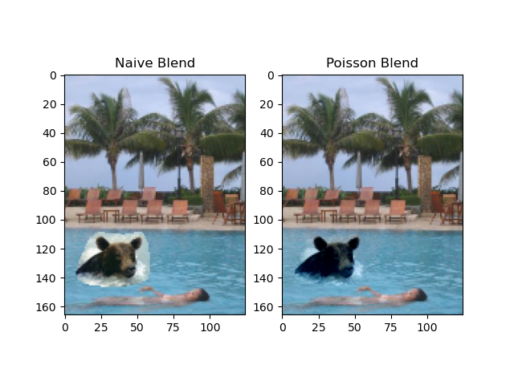
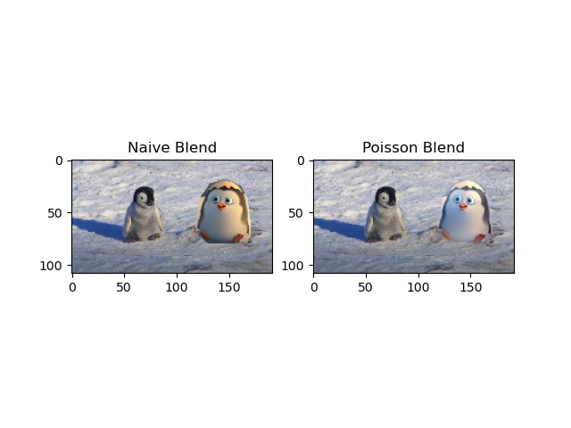
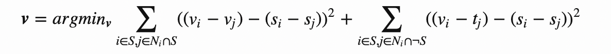
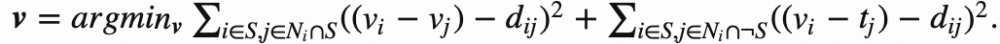

# **Image Processing: Gradient Domain Fusion**
 

1. [Background](#background)
2. [Methods](#method)
3. [File Hierarchy](#file-hierarchy)
4. [Masking](#masking)
5. [Running the Program](#run)
6. [FAQ](#faq)


## **Background**

 We use gradient domain processing to seamlessly clone a source image into a target image. 


  
   
 
Whereas a naive blend results in harsh edges, poisson blending creates smooth edges by enforcing gradient consistency. 


## **Method**

For Poisson blending, we solve the blending constraints in a least squares manner, solving for $v$ in $$Av=b$$

where $A$ is a $(e * hw)$ coefficient matrix, $v$ is a $(hw)$ by $1$ vector, and $b$ is a known $(e * 1)$ vector. 

We construct a new image $v$ where for all pixels $i$ within the desired cropped source region $S$, for each of the 4 surrounding neighbors $j$ we require gradient consistency with source image $s$. 

If neighbor $j$ is outside the $S$, $v_j$ is equal to target image pixel $t_j$. 

  


For Mixed blending, we check whether the gradient in the source or target has the larger magnitude, using it as the guide:

  

```python
if abs(s_i - s_j) >= abs (t_i - t_j):
    d_ij = s_i - s_j
else:
    d_ij = t_i - t_j
```


## **File Hierarchy**
```bash
# Main program
main.py
# Helper program for creating masks
mask.py
```


## **Masking**
---- 
Given a source and target image, ```mask.py``` allows you to select a region of the source image to overlay into the target image by creating aligned masks. 

### **1. Crop desired source region**
- In the first pop up window, click ‘p’ to enter polygon mode. This will allow you to select a polygon by clicking various points. 

- When done selecting the polygon click ‘q’ which will fill in the mask on the image for you to see

- Then, click some point in the center that will be used to align the mask with the second image

- Hit escape when done with first image

- The state of the image can be reset by hitting ‘r’ (note that you will need to hit ‘p’ again to enter polygon mode)

### **2. Align to target image**

- In second popup, click anywhere in the image to overlay mask

- Hit escape when done to save masks

- Click r at anytime to reset frame

## **3. Saving**
- Masks are stored with the same name + “_mask.png” in the same folder as the code
    new source image is stored with name + “_newsource.png”


## **4. Additional controls**:
- click ‘o’ or ‘i’ to rotate the image
    click ‘=‘ or ‘-‘ to resize the image NOTE you must use the saved new source image for the mask to be applicable


## **Run**
---

Once you have your generated masks, 
```bash
# To run the toy problem (image reconstruction)
python main.py -q toy
```

```bash
# To run Poisson blending
# Specify source, target, mask files and run in "blend" mode
python main.py -q blend  \
-s data/{source_name}_newsource.png \
-t data/{target_name}.jpeg   \
-m data/{target_name}_mask.png \
```
For example:

```bash
# Poisson blending
# Specify source, target, mask files and run in "blend" mode
python main.py -q blend  \
-s data/penguin_newsource.png \
-t data/chick.jpeg   \
-m data/chick_mask.png \
```

To run mixed blending, specify ``` -q mixed ```. To run simple reconstruction of the input image, use ``` -q toy ```. 
## **FAQ**
---
- Make sure to represent coefficient matrix $A$ as a sparse matrix (csc_matrix). This way, you can use 

    ```v = scipy.sparse.linalg.lsqr(A,b)```

without worrying about memory consumption problems. 

- You can also downscale the input (decrease ```ratio``` in ```main.py```) images to increase computational speed. 

